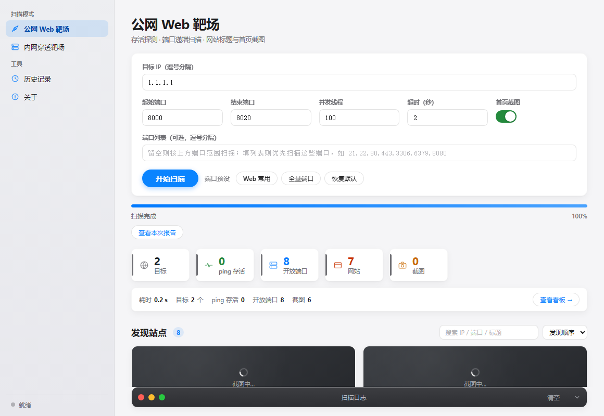

# 靶场扫描助手

一个面向靶场环境的双模式信息收集工具，提供 macOS 和 Windows 桌面启动方式，也支持命令行运行。扫描结果只保存到本地，不上传目标数据。

仓库地址：[Chengxiaoyu1119/yucedu-vlunhub-scan](https://github.com/Chengxiaoyu1119/yucedu-vlunhub-scan)

最新发行版（Windows / macOS）：[Releases](https://github.com/Chengxiaoyu1119/yucedu-vlunhub-scan/releases/latest)



首页预览展示公网 Web 靶场模式，默认端口范围为 `8000–8020`。

## 功能

- 公网 Web 靶场：Ping、TCP 端口扫描、HTTP/HTTPS 标题与 Server 识别、HTML 快照、首页截图和 favicon。
- 内网穿透靶场：ICMP + TCP 存活发现、TTL/端口指纹/SSH Banner/HTTP 标题辅助系统判断、ARP MAC 地址读取。
- 桌面界面：进度、日志、站点卡片、搜索排序、截图灯箱、离线图表和历史记录。
- 每次扫描生成 `report.html`、`report.md`、`report.csv`、`report.json`。
- 内网模式只做无凭据发现，不做登录、爆破或漏洞利用。

## 环境

- Python 3.10 或更高版本。
- GUI 依赖：`pywebview`。
- 首页截图和图表测试依赖：`playwright` 及 Chromium 浏览器。
- Windows 的 pywebview 会优先使用 EdgeChromium，未安装 Edge Runtime 时回退到系统可用的 MSHTML 渲染器。
- Windows 使用系统自带的 `ping`、`arp`、文件管理器和提示音；扫描期间的系统子进程（包括 Playwright/Chromium）统一隐藏控制台窗口，macOS 原有的通知、Finder、Dock 图标和提示音行为保留。
- Windows 发布版默认使用 PyInstaller 生成精简单文件 EXE，不把 Chromium 浏览器压进包内；需要首页截图时可以额外构建完整版。
- macOS 发行版提供 Apple Silicon（arm64）和 Intel（x64）应用包，默认使用系统 WebKit，不内置 Chromium。
- Windows 与 macOS 共用同一套页面视觉和交互细节；Windows 使用 Segoe UI 字体，macOS 使用 Apple 字体栈，业务扫描核心和报告格式在两端共用。

## 安装

Windows 发布版不需要目标电脑安装 Python、pip 或 pywebview。构建者在 Windows 上执行 `scripts\build_windows.ps1`，生成 `.artifacts\dist\靶场扫描助手.exe` 后，双击 `launchers\启动靶场扫描.vbs` 即可无控制台启动；发行包可把 VBS 与 EXE 放在同一目录。默认精简版不内置 Chromium，首页截图会自动关闭；使用 `-IncludeChromium` 才会生成带截图能力的完整版。

macOS 发行版可在 [Releases](https://github.com/Chengxiaoyu1119/yucedu-vlunhub-scan/releases/latest) 下载 `macos-arm64` 或 `macos-x64` ZIP，解压后双击其中的 `靶场扫描助手.app`。应用包为精简版，不内置 Chromium；需要首页截图时使用源码环境安装 Playwright 和 Chromium。

手动安装仅适合开发或命令行使用；下面的 `python` 是 Python 解释器。

```bash
python -m pip install -r requirements.txt
python -m playwright install chromium
```

如果只需要端口扫描、不需要截图，可以不安装 Chromium；程序会自动跳过截图。

## 启动

Windows：只需双击 `launchers\启动靶场扫描.vbs`。它直接启动已打包的 `靶场扫描助手.exe`，不弹出 cmd 窗口，不创建 `.venv`，扫描时也不会额外打开控制台窗口，也不要求目标电脑配置 Python 环境。若找不到 EXE，启动器会提示先运行 `scripts\build_windows.ps1`。开发调试时也可以执行：

```powershell
python -m scanner_app.desktop.gui
```

macOS：双击 `launchers/启动靶场扫描.command`，或执行：

```bash
python3 -m scanner_app.desktop.gui
```

命令行公网扫描：

```bash
python -m scanner_app.cli.public --targets TARGET --port-start 8000 --port-end 8020
```

命令行内网扫描：

```bash
python -m scanner_app.cli.internal --cidrs 192.168.3.0/24,192.168.4.0/24
```

启动入口会先切换到项目目录。开发运行的默认结果统一写入 `.artifacts/results/`，显式传入 `--output` 时使用指定目录；Windows EXE 默认写入 `%LOCALAPPDATA%\靶场扫描助手\scan_results\`。

## 项目结构

```text
scanner_app/
  core/                # 扫描核心、平台适配、截图、报告
  desktop/             # pywebview 桌面桥接层
    web/               # HTML/CSS/JS/图标/Chart.js 等只读界面资源
  cli/                 # 公网/内网命令行入口
tests/                 # 单元测试、离线页面/报告测试和结构边界测试
scripts/               # Windows 构建脚本与 PyInstaller 配置
launchers/             # 每个平台一个双击启动器
docs/assets/           # GitHub README 预览图片等文档素材
.github/workflows/     # 跨平台 CI
```

## 文件分类管理方案

| 分类 | 固定位置 | 只负责什么 | 管理规则 |
| --- | --- | --- | --- |
| 项目入口与说明 | `README.md`、`requirements*.txt` | 使用说明、运行依赖、构建依赖 | 根目录只保留项目级入口文件，不放 Python 源码、页面资源或生成物 |
| 运行代码 | `scanner_app/core/`、`scanner_app/cli/`、`scanner_app/desktop/` | 扫描、报告、平台适配、命令行和桌面桥接 | 按职责归档；核心逻辑不复制到根目录，页面文件不放进核心目录 |
| 页面资源 | `scanner_app/desktop/web/` | HTML、CSS、JS、Chart.js 和应用图标 | `app_icon.svg` 是 VLUN 字标源文件，`app_icon.png` 是运行时和 Windows 构建使用的位图 |
| 双击入口 | `launchers/` | macOS `.command` 和 Windows `.vbs` 启动器 | 只放用户入口，不放 EXE、虚拟环境或日志 |
| 构建与发布 | `scripts/` | Windows/macOS 构建脚本和 PyInstaller 配置 | 只放构建配置，不放运行代码和构建结果 |
| GitHub 文档素材 | `docs/assets/` | README 首页预览图等静态素材 | 不参与运行时打包，不放入 `scanner_app/desktop/web/` |
| 自动化验证 | `tests/` | 平台、目录、页面和报告测试 | 测试截图统一写入 `.artifacts/test-shots/`，不写入源码目录 |
| 本地生成物 | `.artifacts/` | 虚拟环境、构建临时文件、EXE、测试截图和扫描结果 | 已加入 Git 忽略；可删除后重建，发行时只取 `dist/` 中的 EXE |

清理规则：旧入口、重复实现和根目录散落源码直接删除；`__pycache__/`、构建临时目录和测试截图属于可重建缓存；当前发行 EXE、构建虚拟环境和扫描结果按需保留，不纳入版本库。目录边界由 `tests/test_project_structure.py` 固定检查。

## 验证

```bash
python -m compileall -q scanner_app tests
python -m unittest -v tests.test_platform_support
python -m unittest -v tests.test_project_structure
python -m tests.test_charts
python -m tests.test_report_charts
```

两个 Playwright 测试需要先执行 `python -m playwright install chromium`。

推送到 GitHub 后，`.github/workflows/ci.yml` 会在 Windows 和 macOS runner 上分别执行语法检查、平台测试和两个图表测试；macOS runner 还会检查 `.command` 启动器语法与可执行权限。

## 构建 Windows EXE

在 Windows PowerShell 中执行：

```powershell
powershell -ExecutionPolicy Bypass -File .\scripts\build_windows.ps1
```

输出文件为 `.artifacts\dist\靶场扫描助手.exe`。默认命令生成精简版：内置 Python、pywebview 和项目页面资源，不内置 Chromium，因此文件体积显著更小，首页截图开关会显示为不可用。

需要截图能力时执行：

```powershell
powershell -ExecutionPolicy Bypass -File .\scripts\build_windows.ps1 -IncludeChromium
```

完整版会额外内置 Playwright 和 Chromium，适合需要离线截图的发行场景；`.artifacts/` 只用于本地构建和测试产物，不会进入版本库。两种 EXE 都不要求目标电脑单独安装 Python 或 pywebview。冻结版扫描结果写入当前 Windows 用户的 `%LOCALAPPDATA%\靶场扫描助手\scan_results\`，EXE 使用项目图标作为窗口和任务栏图标。

发行包建议包含：`靶场扫描助手.exe`、`启动靶场扫描.vbs` 和本 README。不要把 `.artifacts/`、扫描结果、测试截图或缓存打进发行包。

## 构建 macOS 应用包

GitHub 的版本标签会自动触发 `.github/workflows/release-macos.yml`，分别在 Apple Silicon 和 Intel runner 上执行 `scripts/build_macos.sh`，生成：

- `yucedu-vlunhub-scan-<版本>-macos-arm64.zip`
- `yucedu-vlunhub-scan-<版本>-macos-x64.zip`

本地 macOS 构建：

```bash
RELEASE_VERSION=local bash ./scripts/build_macos.sh
```

应用包使用项目 VLUN 图标，扫描结果写入项目目录下的 `.artifacts/results/`；macOS 发行包不内置 Chromium，首页截图功能需要源码环境额外安装浏览器。

## 版本管理

扫描结果、测试截图、缓存和 macOS/Windows 系统文件已加入 `.gitignore`，不会进入版本库。项目保留双平台启动器，同时将平台差异集中在 `scanner_app/core/platform_support.py`，便于后续维护。

## 目录规范

- 根目录只放项目说明、依赖清单、Git 配置和职责目录，不放运行代码、测试截图或构建产物。
- `scanner_app/core/` 只放扫描、平台适配、截图和报告等运行核心。
- `scanner_app/desktop/` 只放桌面桥接层和本地页面资源；`scanner_app/cli/` 只放命令行入口。
- `tests/` 只放自动化测试；`scripts/` 只放构建配置；`launchers/` 只放双击启动器。
- `docs/assets/` 只放 GitHub 文档预览素材，不参与应用运行和打包。
- `.artifacts/` 是统一的本地生成目录，按 `venv/`、`build/`、`dist/`、`test-shots/`、`results/` 分类，已被 Git 忽略。
- 根目录只允许保留项目入口所需的文档、依赖清单、CI 配置和职责目录；目录边界由 `tests/test_project_structure.py` 自动检查，旧版根目录脚本或新的散落产物会让 CI 直接失败。

## 开发规范

- 第一性原理：先确认入口、输入、核心处理、输出和平台边界，再决定文件归属；不按“哪里方便就放哪里”扩散代码。
- 反向审查：每次移动或重命名后，反查旧路径、导入图、启动器、构建配置和文档，不只依赖正向测试通过。
- 测试分层：先跑结构/路径和平台单元测试，再跑页面、报告和构建验证；测试产物统一落在 `.artifacts/`。
- 调试方式：先复现边界条件，再从最终异常、产物位置和进程树反推根因；修复后保留能阻止回归的最小测试。
