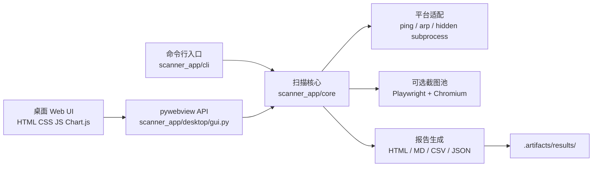

<div align="center">
  
  <h1>靶场扫描助手</h1>
  <p>跨平台靶场信息收集桌面工具 · Windows · macOS · CLI · 本地报告</p>
  <p>
    <a href="https://github.com/Chengxiaoyu1119/yucedu-vlunhub-scan/actions/workflows/ci.yml"></a>
    <a href="https://github.com/Chengxiaoyu1119/yucedu-vlunhub-scan/releases/latest"></a>
    <a href="LICENSE"></a>
    <a href="https://www.python.org/"></a>
    <a href="https://github.com/Chengxiaoyu1119/yucedu-vlunhub-scan/releases"></a>
  </p>
</div>

> 面向本地靶场、安全教学和测试环境的跨平台信息收集工具。它把公网 Web 发现、内网存活探测、桌面可视化和本地报告整理到一套清晰的工作流里。

**仓库** · [GitHub](https://github.com/Chengxiaoyu1119/yucedu-vlunhub-scan)　
**发行版** · [Releases](https://github.com/Chengxiaoyu1119/yucedu-vlunhub-scan/releases/latest)　
**贡献** · [CONTRIBUTING.md](CONTRIBUTING.md)　
**安全报告** · [SECURITY.md](SECURITY.md)　
**更新日志** · [CHANGELOG.md](CHANGELOG.md)


<p align="center"><sub>公网 Web 靶场首页预览 · 默认端口范围 8000–8020 · Windows 与 macOS 共用页面视觉</sub></p>

<details>
<summary><strong>目录导航</strong></summary>

- [项目亮点](#项目亮点)
- [功能地图](#功能地图)
- [安全边界](#安全边界)
- [快速开始](#快速开始)
- [配置与默认值](#配置与默认值)
- [输出结果](#输出结果)
- [架构概览](#架构概览)
- [项目结构](#项目结构)
- [构建与发布](#构建与发布)
- [验证与质量门禁](#验证与质量门禁)
- [常见问题](#常见问题)
- [参与贡献](#参与贡献)
- [许可证](#许可证)

</details>

## 项目亮点

| 方向 | 能力 | 结果 |
| --- | --- | --- |
| 公网 Web 靶场 | Ping、TCP 端口发现、HTTP/HTTPS 识别、标题与 Server、HTML 快照、favicon、首页截图 | 快速了解多个 Web 入口的可见信息 |
| 内网穿透靶场 | ICMP/TCP 存活发现、TTL、端口指纹、SSH Banner、HTTP 标题、ARP MAC | 形成主机、系统线索和开放端口概览 |
| 桌面体验 | 进度、日志、站点卡片、搜索排序、截图灯箱、离线图表、历史看板 | 扫描过程可观察，结果可回看 |
| 命令行 | 公网与内网两个 CLI 入口，参数可脚本化 | 适合重复任务和自动化流程 |
| 本地报告 | HTML、Markdown、CSV、JSON 四种输出 | 便于浏览、归档、二次处理和分享 |
| 双平台发行 | Windows x64 精简版 EXE、macOS arm64/x64 应用包 | 下载后按平台直接启动 |

## 功能地图

```text
输入目标
   │
   ├─ 公网 Web 模式 ── Ping / TCP / HTTP / HTML / favicon / 可选截图
   │                         │
   └─ 内网模式 ─────── ICMP / TCP / TTL / Banner / ARP
                             │
                             ▼
                    统一事件流与结构化结果
                             │
             ┌───────────────┼────────────────┐
             ▼               ▼                ▼
         桌面看板          CLI 输出          本地报告
       pywebview + Web    stdout / 参数    HTML / MD / CSV / JSON
```

## 安全边界

本项目定位是信息收集和结果整理工具，默认保持低侵入、可观察、可回滚：

- 只面向本地靶场、安全教学和测试环境。
- 内网模式只做无凭据发现，不包含登录、凭据爆破或漏洞利用流程。
- 不包含持久化、提权、数据外传、规避检测或反分析功能。
- 运行结果默认落盘到本地，不自动上传目标数据。
- 发现安全问题请遵循 [SECURITY.md](SECURITY.md)，不要把敏感复现细节贴到公开 Issue。

## 快速开始

### 直接下载发行版

打开 [最新 Releases](https://github.com/Chengxiaoyu1119/yucedu-vlunhub-scan/releases/latest)，按系统选择：

| 平台 | 文件 | 启动方式 | 说明 |
| --- | --- | --- | --- |
| Windows x64 | `*-windows-x64.zip` | 解压后双击 `启动靶场扫描.vbs` | EXE、`playwright-browsers/`、`playwright-runtime/` 放在同一目录 |
| macOS Apple Silicon | `*-macos-arm64.zip` | 解压后双击 `靶场扫描助手.app` | Apple Silicon；使用系统 WebKit |
| macOS Intel | `*-macos-x64.zip` | 解压后双击 `靶场扫描助手.app` | Intel；使用系统 WebKit |

macOS 应用包当前没有 Apple notarization。首次打开时，如果系统弹出来源提示，可在 Finder 中右键应用并选择“打开”。

### 源码运行

环境要求：

- Python 3.10 或更高版本。
- 桌面界面依赖 `pywebview`。
- 首页截图依赖 Playwright 和 Chromium；只做端口发现时可以跳过 Chromium。

```bash
python -m venv .venv
python -m pip install -r requirements.txt
python -m playwright install chromium
```

启动桌面界面：

```bash
python -m scanner_app.desktop.gui
```

Windows 双击入口：

```text
launchers/启动靶场扫描.vbs
```

macOS 双击入口：

```bash
chmod +x launchers/启动靶场扫描.command
./launchers/启动靶场扫描.command
```

### CLI 示例

公网 Web 靶场默认扫描两个示例目标的 `8000–8020` 端口：

```bash
python -m scanner_app.cli.public
```

指定目标和范围：

```bash
python -m scanner_app.cli.public \
  --targets TARGET \
  --port-start 8000 \
  --port-end 8020 \
  --threads 100 \
  --timeout 2
```

内网模式：

```bash
python -m scanner_app.cli.internal \
  --cidrs 192.168.3.0/24,192.168.4.0/24 \
  --ports 22,80,443,135,139,445,3389,8080
```

## 配置与默认值

### 公网 Web 模式

| 配置 | 默认值 | 说明 |
| --- | --- | --- |
| 目标 | `43.139.231.237,43.139.149.11` | GUI 和 CLI 的示例目标，可通过参数覆盖 |
| 起始端口 | `8000` | 默认范围起点 |
| 结束端口 | `8020` | 默认范围终点，包含该端口 |
| 并发线程 | `100` | TCP 探测并发量 |
| 超时 | `2` 秒 | 连接和请求的单次超时 |
| 首页截图 | 可选 | Windows 发行包默认可用；源码环境需安装 Chromium |

公网结果页只保留三项同时满足的目标：Ping 存活、HTTP/HTTPS 首页可访问、页面 `<title>` 非空。Ping 不通、端口不是 Web 服务、页面访问失败或标题为空的目标不会生成站点卡片，也不会进入公网报告。

### 内网模式

| 配置 | 默认值 |
| --- | --- |
| CIDR | `192.168.3.0/24, 192.168.4.0/24` |
| 端口 | `22, 80, 443, 135, 139, 445, 3389, 8080` |
| 并发线程 | `64` |
| 超时 | `1` 秒 |

显式传入 `--output` 时使用指定目录；开发运行默认输出到 `.artifacts/results/`，Windows EXE 默认输出到 `%LOCALAPPDATA%\靶场扫描助手\scan_results\`。

## 输出结果

每次扫描会在结果目录中生成：

```text
<result>/
├─ report.html       # 可直接用浏览器打开的可视化报告
├─ report.md         # Markdown 摘要
├─ report.csv        # 表格化端口和主机数据
├─ report.json       # 结构化原始结果
├─ <ip>_<port>.html  # Web 首页快照
├─ <ip>_<port>.png   # 可选首页截图
└─ <ip>_<port>_icon.*# 可选 favicon
```

报告图表使用离线资源生成，不依赖外部 CDN；结果目录可以直接归档或交给后续脚本处理。

## 架构概览



核心设计原则：扫描器通过结构化事件向 GUI 和 CLI 提供进度；平台差异集中在 `platform_support.py`；页面资源和报告模板保持离线可用。

## 项目结构

```text
.
├─ scanner_app/
│  ├─ core/                 # 扫描、平台适配、截图、报告
│  ├─ desktop/              # pywebview 桌面桥接与 Web UI
│  └─ cli/                  # 公网/内网命令行入口
├─ launchers/               # Windows VBS、macOS command 双击入口
├─ scripts/                 # Windows/macOS 构建、打包与发布脚本
│  ├─ build_windows.ps1
│  ├─ package_windows.ps1
│  └─ build_macos.sh
├─ tests/                   # 平台、目录、页面和报告测试
├─ docs/assets/             # README 预览图等 GitHub 文档素材
├─ .github/
│  ├─ workflows/            # CI 与 macOS Release 打包
│  ├─ ISSUE_TEMPLATE/       # Bug / Feature 表单
│  ├─ dependabot.yml        # 依赖更新配置
│  └─ PULL_REQUEST_TEMPLATE.md
├─ CHANGELOG.md
├─ CONTRIBUTING.md
├─ SECURITY.md
├─ CODE_OF_CONDUCT.md
├─ LICENSE
└─ README.md
```

目录边界保持简单：源码只放 `scanner_app/`，双击入口只放 `launchers/`，构建与打包只放 `scripts/`，测试只放 `tests/`，GitHub 展示素材只放 `docs/assets/`。虚拟环境、构建中间文件、EXE、外置 Chromium、截图运行时、测试截图、扫描结果和本地发行包统一放入 `.artifacts/`，不进入版本库。Windows 截图发行包必须同时保留 EXE、VBS、`playwright-browsers/` 和 `playwright-runtime/`。

## 构建与发布

### Windows EXE

在 Windows PowerShell 执行：

```powershell
powershell -ExecutionPolicy Bypass -File .\scripts\build_windows.ps1
```

输出：`.artifacts\dist\靶场扫描助手.exe`、`.artifacts\dist\playwright-browsers\` 和 `.artifacts\dist\playwright-runtime\`。默认构建把 Chromium 与 Playwright Node 驱动放到 EXE 同级目录，因此 Windows 公网扫描可以直接截图，EXE 不再携带这两块大运行时。EXE 使用 VLUN 多尺寸项目图标。

组装可直接发布的 ZIP：

```powershell
powershell -ExecutionPolicy Bypass -File .\scripts\package_windows.ps1 -Version vNEXT
```

输出位于 `.artifacts\release\windows\`，包含 EXE、VBS、README、首页预览图、截图用 Chromium 和 Playwright Node 驱动。

### macOS 应用包

在 macOS 上执行：

```bash
RELEASE_VERSION=local bash ./scripts/build_macos.sh
```

脚本会生成带项目图标的 `.app`，并根据当前机器架构生成 macOS ZIP。推送 `v*` 标签后，`.github/workflows/release-macos.yml` 会在 Apple Silicon 和 Intel runner 上自动构建并把两个 ZIP 上传到对应 Release。

### 发行包组成

- Windows：`靶场扫描助手.exe`、`启动靶场扫描.vbs`、`playwright-browsers/`、`playwright-runtime/`、`README.md` 和首页预览图。
- macOS：`靶场扫描助手.app`。
- 不把 `.artifacts/`、测试截图、扫描结果、缓存或开发虚拟环境打进发行包。

## 验证与质量门禁

语法和目录边界：

```bash
python -B -m compileall -q scanner_app tests
python -B -m unittest discover -v
git diff --check
```

页面和报告：

```bash
python -B -m tests.test_charts
python -B -m tests.test_report_charts
```

GitHub Actions 会在 Windows 和 macOS 上执行语法、平台、项目结构、截图运行时、GUI 图表和报告图表检查；Windows runner 额外构建带外置 Chromium 与 Node 驱动的精简 EXE，并检查多尺寸图标和发行资源，macOS runner 检查 `.command` 语法、可执行权限和启动烟测。

## 常见问题

### Windows 文件夹里仍显示旧图标

资源管理器会缓存同一路径的图标。关闭文件夹后重新打开并按 `F5`；如果仍未刷新，把发行包解压到新目录再查看。最新 EXE 的内部资源包含 `16/24/32/48/64/128/256` 七种 VLUN 图标尺寸。

### Windows 首页截图失败

Windows 发行版的 EXE 与截图运行时分离：确认 `playwright-browsers/`、`playwright-runtime/` 与 EXE 位于同一目录，不要只复制 EXE。重新解压完整 ZIP 后双击 `启动靶场扫描.vbs`。源码环境执行 `python -m playwright install chromium`；如果仍不可用，查看扫描日志中的 Chromium 路径提示。

### 为什么 EXE 不大但发行 ZIP 较大

Chromium 和截图驱动本身体积较大。项目把它们作为 EXE 同级资源打包，避免 EXE 变成几十或几百 MB，同时保留 Windows 公网首页截图功能；Windows 发行 ZIP 会明显大于单独 EXE，这是运行资源拆分后的结果。

### Windows 双击没有启动

优先双击 `启动靶场扫描.vbs`，不要直接双击开发入口。确认 VBS 与 EXE 位于同一发行目录；如果从源码运行，先执行 `python -m scanner_app.desktop.gui` 检查依赖和具体错误。

### macOS 首次打开被系统拦截

当前发行包没有 Apple notarization。打开 Finder，右键 `靶场扫描助手.app`，选择“打开”并确认；开发环境也可以直接使用 `launchers/启动靶场扫描.command`。

## 参与贡献

欢迎提交 Bug、功能建议、跨平台修复和文档改进。请先阅读：

- [CONTRIBUTING.md](CONTRIBUTING.md)
- [CODE_OF_CONDUCT.md](CODE_OF_CONDUCT.md)
- [SECURITY.md](SECURITY.md)
- [Pull Request 模板](.github/PULL_REQUEST_TEMPLATE.md)

## 许可证

本项目使用 [MIT License](LICENSE)。第三方资源遵循各自的许可证：页面中使用的 Chart.js 及其依赖信息保留在对应资源和发行包中。

## 更新日志

完整版本记录见 [CHANGELOG.md](CHANGELOG.md)，可下载版本和校验值见 [GitHub Releases](https://github.com/Chengxiaoyu1119/yucedu-vlunhub-scan/releases)。
